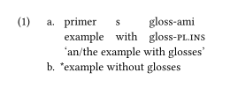

# Typeset linguistic examples with the Simplest Syntax possible

This is a [Typst](https://github.com/typst/typst) package that provides linguistic examples and interlinear glossing. It is a heavily modified fork of [neunenak's typst-leipzig-glossing](https://github.com/neunenak/typst-leipzig-glossing).

# Example

Numbered lists are treated as subexamples, and bullet lists — as glosses. Typesetting an example is as simple as

```typst
#import "@preview/eggs:0.1.0": example as ex, judge as j, abbreviations
#import abbreviations: pl, ins
#show: eggs

#ex[
  + - primer   s     gloss-ami
    - example  with  gloss-#pl.#ins
    'an/the example with glosses'
  + #j[\*]example without glosses
]
```



# Contributing

Please submit an issue for any bug you find and any suggestion you have.

Contributions are much welcome, too.

TODO:
- Automatic numbering in footnotes;
- Smarter gloss line styling;
- Figure out how to modify spacing between examples specifically;
- `\trailingcitation`.

## License
MIT License.

## Special thanks

- [Thumus](https://github.com/Thumuss), [bluss](https://github.com/bluss), and especially [Laurenz](https://github.com/laurmaedje) for an important discussion on row splitting functionality.
- [Greg Shuflin](https://github.com/neunenak) and contributors for creating the original leipzig-glossing.
